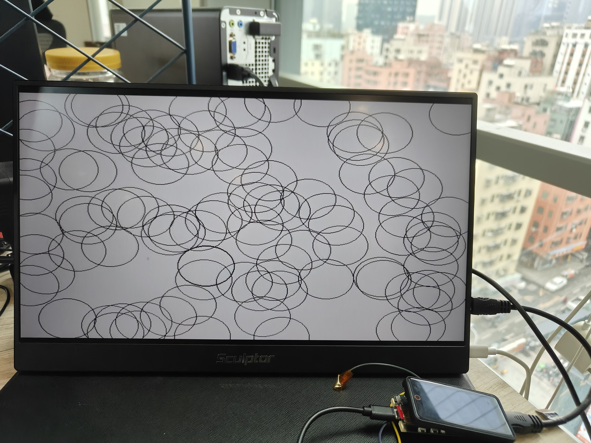
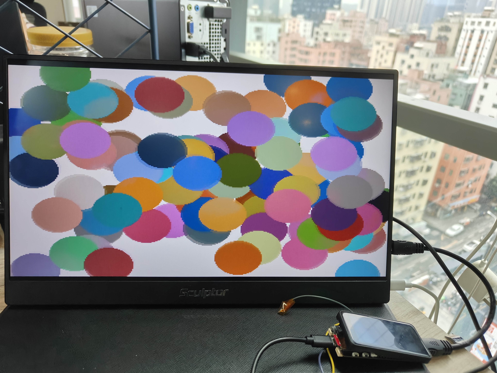
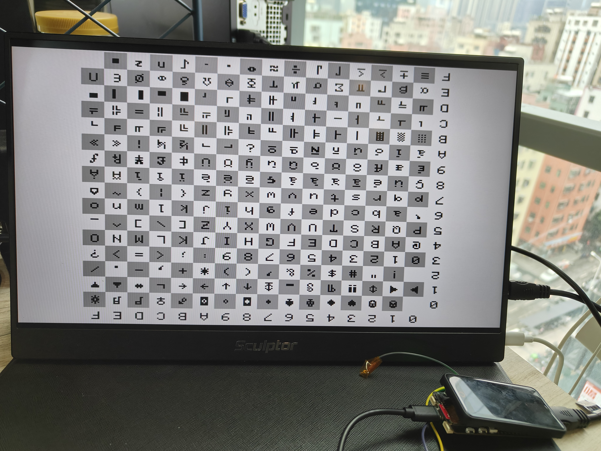
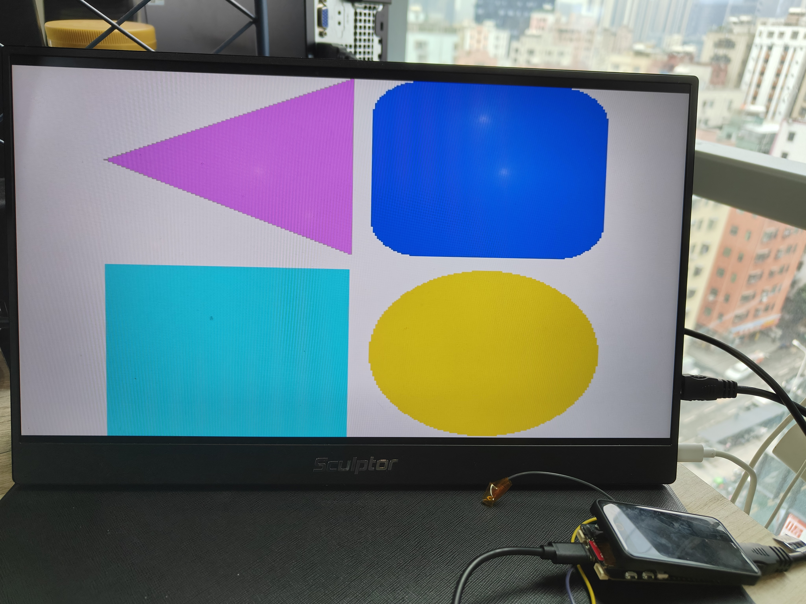

Arduino Examples for PicoDVI Library
====================================
## Implementation principle
The HSTX interface of RP2350 is used to transmit image data through the DVI interface after TMDS encoding, and the image is displayed on the screen, but the audio data cannot be transmitted

## Matters needing attention
1. We test that 8bit `400*240p60` and `400*240p30` and `320*240p60` and `320*240p30` can be displayed under a 1080P display,However, using `800*480p30 single buffer` can not successfully drive the screen under `800*480` display.

2. Not currently supported `8 bit double buffer 800*480p60` and `16 bit 800*480p(30/60)`

3. It is important to select the correct screen resolution when calling the routine

4. The original github address [PicoDVI Library](https://github.com/adafruit/PicoDVI)

## examples picture

    
     
    1 BIT double 640*480P60 @ 1080P

    
     
    8 BIT double 320*240P60 @ 1080P

    
    
     
    16 BIT 320*240P60 @ 1080P

